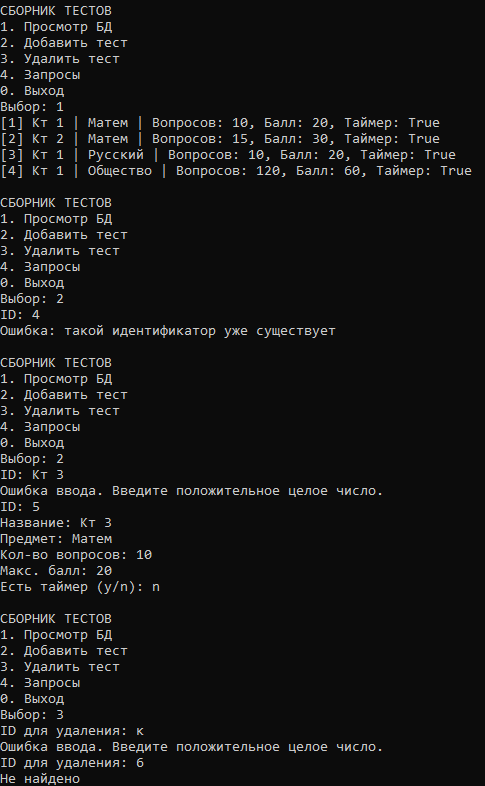
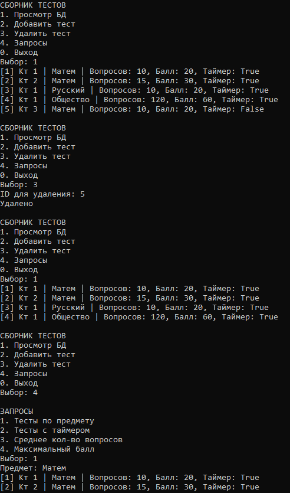
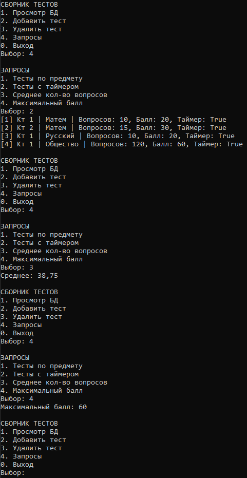

# Радостев Павел ИТС-2 Лабораторная №8

# Задание 1

## Задача 1

### Текст задачи
Разработать консольное приложение с дружественным интерфейсом с возможностью выбора заданий для работы с «базой данных (БД)», хранящейся в бинарном файле. Перечень полей (минимум 5), достаточно полно характеризующих заданную в варианте предметную область, предложить самостоятельно (постараться отразить в перечне полей такие, которые требуют разных типов данных). Приложение должно выполнять следующие функции:
1. Чтение базы данных из бинарного файла.
2. Просмотр базы данных.
3. Удаление элементов (по ключу).
4. Добавление элементов.
5. Реализация 4 запросов (формулировки запросов придумать самостоятельно). 2 запроса должны возвращать перечень, 2 запроса одно значение.
В классе должны присутствовать свойства, конструкторы, перегруженный метод ToString(). Весь функционал приложения реализовать в виде методов вспомогательного класса с помощью LINQзапросов.
Предусмотреть обработку возможных ошибок при работе программы.
Пункт 5 оценивается в 2 балла, остальные пункты по 1 баллу. Максимально за лабораторную работу можно получить 6 баллов.
Задание по варианту: сборник тестов

### Алгоритм работы программы
1. Создать объект хранилища тестов.
2. Загрузить данные из файла.
3. Отобразить главное меню.
4. Получить выбор пользователя.
5. Выполнить соответствующую операцию.
6. После выполнения операции вернуться в главное меню.
7. При выборе пункта «Выход» завершить работу программы.

### Алгоритм добавления теста
1. Запросить идентификатор теста.
2. Проверить наличие теста с таким идентификатором.
3. Если идентификатор уже существует, вывести сообщение об ошибке.
4. Иначе запросить:
    - название теста;
    - предмет;
    - количество вопросов;
    - максимальный балл;
    - наличие таймера.
5. Создать новый объект теста.
6. Добавить тест в коллекцию.
7. Сохранить изменения в файл.

### Алгоритм удаления теста
1. Запросить идентификатор теста.
2. Найти тест с указанным идентификатором.
3. Если тест найден, удалить его из коллекции.
4. Сохранить изменения в файл.
5. Вывести сообщение о результате операции.

### Алгоритм просмотр базы данных
1. Получить коллекцию тестов.
2. Последовательно перебрать все элементы коллекции.
3. Вывести информацию о каждом тесте на экран.

### Алгоритм вывода тестов по заданному предмету
1. Запросить название предмета.
2. Последовательно просмотреть все тесты.
3. Для каждого теста проверить совпадение предмета с введённым значением.
4. Если предмет совпадает, вывести информацию о тесте.
5. После завершения просмотра вывести все найденные записи.

### Алгоритм вывода тестов с таймером
1. Последовательно просмотреть все тесты.
2. Проверить значение признака наличия таймера.
3. Если таймер присутствует, вывести информацию о тесте.
4. Продолжить просмотр до конца коллекции.

### Алгоритм нахождения среднего количества вопросов
1. Инициализировать сумму количества вопросов.
2. Последовательно перебрать все тесты.
3. Добавить количество вопросов каждого теста к общей сумме.
4. Разделить полученную сумму на количество тестов.
5. Вывести среднее значение.

### Алгоритм нахождения максимального балла
1. Принять максимальный балл первого теста за текущий максимум.
2. Последовательно просмотреть остальные тесты.
3. Если балл текущего теста больше найденного максимума, обновить максимум.
4. После завершения просмотра вывести максимальный балл.

### Тестирование

